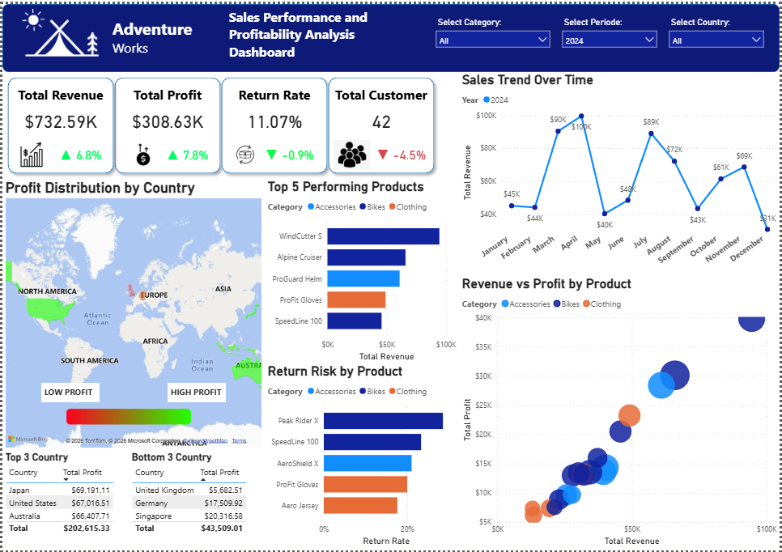

# 📊 Adventure Works Sales Performance Dashboard

## 📌 Overview

This project analyzes sales performance and profitability using the Adventure Works dataset for the year 2024.
The objective is to identify key revenue drivers, evaluate product performance, and uncover potential business risks to support data-driven decision making.

---

## ❓ Business Questions

* Which products generate the highest revenue?
* How does sales performance vary by country?
* What are the sales trends over time?
* Which products have the highest return rates?
* What is the relationship between revenue and profit?

---

## 📷 Dashboard Preview

---

## 📊 Key Insights

* 🚴‍♂️ **Bikes category dominates** both revenue and profit, acting as the main business driver
* 🌍 **Top-performing countries** include Japan, United States, and Australia
* 📈 Sales trend shows **fluctuations**, with peaks in April and August
* ⚠️ Products like *Peak Rider X* and *SpeedLine 100* have **high return rates**
* 💰 Higher revenue products generally generate higher profit

---

## 🚀 Recommendations

* Focus on high-performing products (e.g., WindCutter S, Alpine Cruiser)
* Expand strategies in top-performing countries
* Optimize promotions during peak sales periods
* Investigate products with high return rates
* Improve profitability of lower-performing categories

---

## 🛠 Tools Used

* Power BI
* DAX

---

## 📂 Files

* 📊 [Download Power BI Dashboard](Dashboard-Adventure-Works.pbix)
* 📄 [View Full Analysis](Analysis-Adventure-Works.pdf)

---

## 📥 How to Use

* Download the `.pbix` file and open it using **Power BI Desktop**
* Open the PDF file to explore detailed analysis and insights

---
